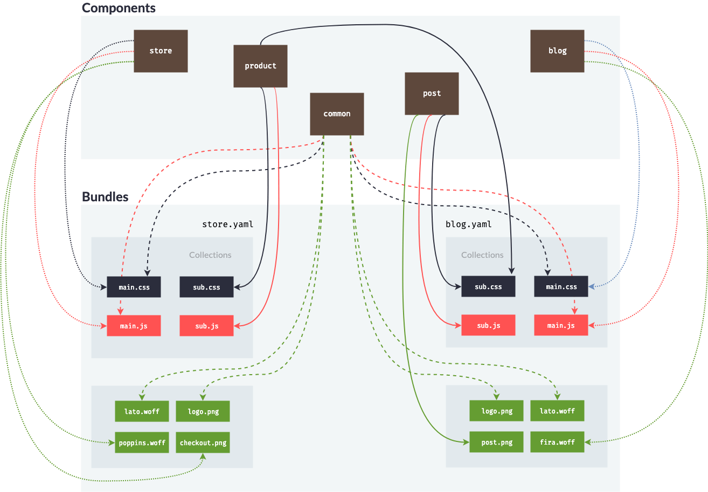

> [Work in progress]

# Architecture

| Components                 	|            store            	|      product      	|         common        	|        post       	| blog                	|
|----------------------------	|:---------------------------:	|:-----------------:	|:---------------------:	|:-----------------:	|:---------------------:|
| **Bundle : Store => main**   	| main.css main.js         	|         ❌         	| main.css main.js   	|         ❌         	|          ❌          	|
| **Bundle : Store => sub**    	|              ❌              	| sub.css sub.js 	| ❌                     	|         ❌         	|          ❌          	|
| **Bundle : Store => Assets** 	| poppin.woff checkout.png 	|         ❌         	| lato.woff logo.png 	|         ❌         	|          ❌          	|
|           -----           	|             ---             	|        ---        	|          ---          	|        ---        	|         ---         	|
| **Bundle : Blog => main**    	|              ❌              	|         ❌         	| main.css main.js   	|         ❌         	| main.css main.js 	|
| **Bundle : Blog => sub**     	|              ❌              	| sub.css           	|           ❌           	| sub.css sub.js 	|          ❌          	|
| **Bundle : Blog => Assets**  	|              ❌              	|         ❌         	| logo.pnp lato.woff 	| post.png          	| fira.woff           	|

## [Components](components.md)
- Store
- Product
- Common
- Post
- Blog

## [Bundles](bundles.md)
- `store.yaml`
- `blog.yaml`

## [Collections](collections.md)
- **Store =>  Main :** `main.css` & `main.js`
- **Store => Sub :** `sub.css` & `sub.js`
- **Blog => Main :** `main.css` & `main.js`
- **Blog => Sub :** `sub.css` & `sub.js`

## [Assets](../assets/readme.md)
- Store => `lato.woff`
- Store => `poppins.woff`
- Store => `logo.png`
- Store => `checkout.png`
- Blog => `lato.woff`
- Blog => `fira.woff`
- Blog => `logo.png`
- Blog => `post.png`

## Exemple
This exemple will generate the following files
- store /
  - styles /
    - `main.css`
    - `sub.css`
  - scripts /
    - `main.js`
    - `sub.js`
  - assets /
    - `lato.woff`
    - `poppins.woff`
    - `logo.png`
    - `checkout.png`
- blog /
  - styles /
    - `main.css`
    - `sub.css`
  - scripts /
    - `main.js`
    - `sub.js`
  - assets /
    - `lato.woff`
    - `fira.woff`
    - `logo.png`
    - `post.png`
