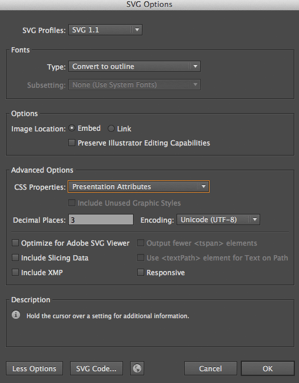

# Inline images
> Inline images assets are image files (.gif, .jpg, .png, .svg) that will be embedded in the built CSS files.


## Goal and trade-off
The goal of this practice is to reduce de number of requested files on a page load for small images file.

Other solutions like the use of sprite images and icon font set are not encouraged for sake of maintainability, versatility and consistency.

The weight of the built CSS file is evidently bigger, but with the help of gzip the combined final weight difference is completely acceptable versus the gains.

These images aren't crawlable at all by search engines, so any image with a SEO value shouldn't use this (ex: a site's logo).


## Paths
The source files are located under `[NWAYO_ROOT]/components/[NAME]/assets/inline-images/`.


## Processing
Files are optimized losslessly via [gifsicle](https://www.lcdf.org/gifsicle), [MozJPEG](https://github.com/mozilla/mozjpeg), [optipng](http://optipng.sourceforge.net), [svgo](https://github.com/svg/svgo), which means that they need to be quality-optimized beforehand because this process only shims the extra useless kB.

### Binary formats (GIF, JPG, PNG)
These will be embedded in the `background-image:url()` via a Base64 encoding.

**Example:**
```scss
background-image: url("data:image/png;base64,iVBORw0KGgoAAAANSUhEUgAAAAEAAAABCAYAAAAfFcSJAAAADUlEQVR42m");
```

### SVG
The raw source of these will be embedded in the `background-image:url()` minus minor adjustments for compatibility.

Also since the color codes are in plain text, there is an option in the mixin to change the different colors of the source file for other colors.

**Example:**
```scss
background-image: url("data:image/svg+xml;charset=utf8,%3Csvg xmlns='http://www.w3.org/2000/svg' viewBox='0 0 25 7'%3E%3Cpath fill='%23ff5252' d='M0 0h10L5 7z'/%3E%3C/svg%3E");
```


## Best practices

### Binary formats
- Only PNG should be use since it is better than GIF and JPG isn't normally used for small iconography.
- Optimize via [TinyPNG](https://tinypng.com).

### SVG
- SVG should always use the default replacement colors `#ba0bab` and `#c0ffee` and let the SCSS variables drive the final colors.
- Optimize Illustrator export with these settings:
- 


## Usage
In styles, these inline images can be accessed via the [images mixins](../styles/images.md).


## Bundles
Inline images are selected for build via the SCSS code included in the `styles.collections` property of the bundle file.


## Tasks
These tasks interact with the inline images:
- styles
- styles-compile
- styles-images
- rebuild
- rebuild-ss
